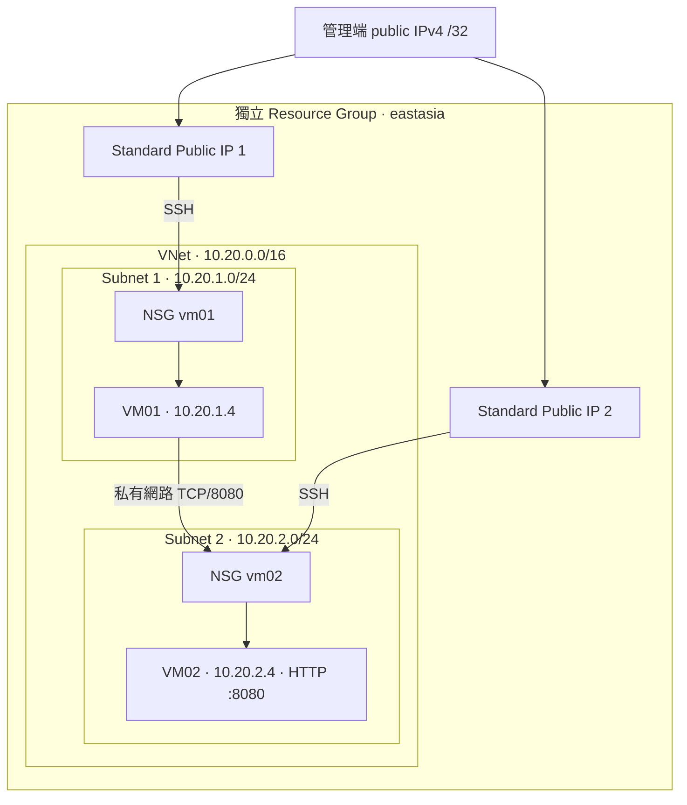

# azure-tf-rebuild

**使用 Terraform 重建 Azure 雙子網 Linux Lab，練習 NSG 流量控制、cloud-init 與可重複部署。**

將 Azure 基礎設施寫成程式碼，透過兩台 Ubuntu VM 驗證跨子網 HTTP 存取，並把部署、排障與清除資源整理成可重現的流程。

## 專案重點

- 使用 AzureRM provider 管理 Resource Group、VNet、Subnet、NSG、Public IP、NIC 與 Linux VM。
- 兩個 subnet 分別套用 NSG；SSH 僅允許指定管理端 public IPv4 `/32`。
- VM02 的 TCP/8080 僅允許 VM01 私有 IP，其他來源明確拒絕。
- cloud-init 安裝工具，由 systemd 在 VM02 啟動 Python HTTP 測試服務。
- `create_compute = false` 預設僅部署網路；需要驗證時再建立 VM。
- 使用獨立 RG 與 local state，不匯入或刪除原本手動建立的 Azure 環境。

## 實機驗證

本次已在 Azure East Asia 完成部署、服務與網路驗證，再以 Terraform 清除 Lab。以下結果整理自實際 PowerShell／SSH 輸出。

| 驗證環境 | 紀錄 |
|---|---|
| 日期 | 2026-09-22（台灣時間；版本紀錄時間 00:07 +08:00） |
| 受測 commit | `3b7f2b3` |
| 執行端 | Windows AMD64／PowerShell |
| Terraform | `1.16.3` |
| AzureRM provider | `4.81.0` |
| Resource Group | `rg-tommy-tf-rebuild` |

| 驗證項目 | 結果與證據 |
|---|---|
| Provider 初始化 | PASS：`Terraform has been successfully initialized!` |
| Terraform 格式檢查 | PASS：`terraform fmt -check`，exit code `0` |
| Terraform validate | PASS：`Success! The configuration is valid.`，exit code `0` |
| Azure 部署 | 完成：操作者確認 apply 成功；後續兩台 VM 的 SSH 與服務測試成功 |
| 管理端 → 兩台 VM TCP/22 | PASS：兩台 `TcpTestSucceeded : True`，SSH 金鑰登入成功 |
| 兩台 VM cloud-init | PASS：皆回傳 `status: done` |
| VM02 systemd 服務 | PASS：`systemctl is-active lab-http` 回傳 `active` |
| VM02 HTTP listener | PASS：Python 監聽 `0.0.0.0:8080` |
| VM02 本機 HTTP | PASS：回傳 `Hello from vm02 - built by Terraform` |
| VM01 → VM02 私有 IP TCP/8080 | PASS：回傳預期頁面，curl exit code `0` |
| Windows → VM02 Public IP TCP/8080 | PASS：連線逾時，curl exit code `28` |
| 部署後無變更 plan | PASS：`No changes. Your infrastructure matches the configuration.`，exit code `0` |
| Terraform destroy | PASS：`Destroy complete! Resources: 20 destroyed.` |
| Azure RG 清除 | PASS：`az group exists --name $rg` 回傳 `false` |
| 清除後 Terraform state | PASS：`terraform state list` 沒有列出任何資源 |

部署時的 `Apply complete!` 輸出未留存；部署結果由後續實際登入、服務測試與 refreshed plan 佐證。清除後 `terraform state list` 沒有列出任何資源，與 Azure RG 不存在的檢查結果一致。

### 關鍵輸出

以下保留實際測試的關鍵內容；Public IP 以變數表示，不刊登 subscription ID。

從 VM01 經私有網路連到 VM02：

```powershell
ssh -i ~/.ssh/azure-tf-lab azureuser@"$VM01_PUBLIC" "curl --connect-timeout 5 --max-time 10 -fsS http://10.20.2.4:8080"
# Hello from vm02 - built by Terraform
$LASTEXITCODE
# 0
```

從 Windows 管理端連到 VM02 的 Public IP：

```powershell
curl.exe --connect-timeout 5 --max-time 10 "http://${VM02_PUBLIC}:8080"
# curl: (28) Connection timed out after 5014 milliseconds
$LASTEXITCODE
# 28
```

內部 HTTP 成功與外部連線失敗，符合本次存取設計；timeout 本身不能單獨證明命中哪一條 NSG 規則。本次未測試第三台 VNet client，也未驗證非管理來源的 SSH 拒絕。

`No changes` 表示 Terraform 刷新後未發現受管理屬性與設定的差異，不代表已檢查 VM 內所有檔案或設定。

完整重現步驟與排障方式見 [驗證與排障](docs/validation.md)。

## 需求

- Terraform `>= 1.9.0, < 2.0.0`；lock file 固定 AzureRM `4.81.0`。
- Azure CLI、OpenSSH client。
- Azure subscription，以及建立此 Lab 資源所需權限與 VM quota。
- 以下本機指令使用 **Windows PowerShell**；SSH 內執行的是 Linux 指令。

## 快速啟動

```powershell
az login
az account set --subscription "YOUR_SUBSCRIPTION_ID"
az account show --query '{name:name,id:id}' -o table
Copy-Item terraform.tfvars.example terraform.tfvars
```

編輯 `terraform.tfvars`：

```hcl
subscription_id     = "YOUR_SUBSCRIPTION_ID"
location            = "eastasia"
prefix              = "tommy-tf-rebuild"
admin_cidr          = "YOUR_CURRENT_PUBLIC_IPV4/32"
ssh_public_key_path = "C:/Users/Tommy/.ssh/azure-tf-lab.pub"
vm_size             = "Standard_B1s"
create_compute      = false
```

若尚未建立專用 SSH key，執行以下單行指令；已有同名 key 時不要覆寫：

```powershell
ssh-keygen -t rsa -b 4096 -f "$env:USERPROFILE/.ssh/azure-tf-lab" -C "azure-tf-rebuild"
```

先建網路：

```powershell
terraform init
terraform fmt -check
terraform validate
terraform plan -out=network.tfplan
terraform apply network.tfplan
```

確認 plan 只包含新 Lab 的資源。接著將 `create_compute` 改成 `true`：

```powershell
terraform plan -out=compute.tfplan
terraform apply compute.tfplan
terraform output
```

VM 建立成功不代表 cloud-init 已完成；接著執行 [驗證流程](docs/validation.md)。

## 整體架構



兩張 NIC 各有 Standard Public IP，提供管理入口與明確的對外連線方式。Subnet 關閉 default outbound access；本 Lab 未使用 NAT Gateway 或 Bastion。

## Network 設計

| 套用範圍 | Priority | 規則 | 效果 |
|---|---:|---|---|
| 兩個 subnet | 100 | Allow-SSH-Admin | 允許管理端 `/32` 到 TCP/22 |
| 兩個 subnet | 110 | Deny-Other-SSH | 拒絕其他 SSH 來源 |
| VM02 subnet | 200 | Allow-8080-VM01 | 允許 `10.20.1.4/32` 到 `10.20.2.4:8080` |
| VM02 subnet | 210 | Deny-Other-8080 | 拒絕其他 TCP/8080 來源 |

NSG 僅關聯 subnet，沒有額外 NIC NSG。數字較小的 priority 先匹配。其他連接埠仍受 NSG 預設規則影響，包括預設 VNet 允許規則；這不是所有流量預設拒絕的完整微分段設計。

## VM 與啟動流程

| 項目 | 設定 |
|---|---|
| OS | Ubuntu 24.04 LTS，image version 為 `latest` |
| VM size | `Standard_B1s`，可依區域供應與 quota 調整 |
| OS disk | 每台 32 GB Standard SSD LRS |
| 登入 | `azureuser` + SSH public key；停用密碼登入 |
| VM01 | HTTP client；安裝 curl、netcat、Python |
| VM02 | 相同工具；啟用 `lab-http.service` |

Terraform 等 NSG 關聯與自訂規則建立後才建 VM。cloud-init 寫入測試頁與 systemd unit；只有 VM02 啟用 HTTP 服務。Python HTTP server 用於連線驗證，不是正式服務部署。

## 變數與輸出

| 變數 | 預設／用途 |
|---|---|
| `subscription_id` | 必填，Azure subscription |
| `location` | `eastasia` |
| `prefix` | `tommy-tf-rebuild`；RG 名稱為 `rg-${prefix}` |
| `admin_cidr` | 必填，目前管理端 public IPv4 `/32` |
| `ssh_public_key_path` | 必填，本機 `.pub` 檔案路徑 |
| `vm_size` | `Standard_B1s` |
| `create_compute` | `false`；控制 VM、NIC、Public IP 是否建立 |

`resource_group` 輸出 RG 名稱，`public_ips` 輸出實際 Public IP。`private_ips` 來自規劃設定，因此即使尚未建立 VM，也會顯示兩個私有 IP。

## 成本與清除

主要費用來自兩台 VM、兩顆 managed disk、兩個 Standard Public IP，以及可能的網路流量與磁碟交易。實際費率依 `eastasia`、訂閱與使用量確認。

- `create_compute = false` 適合先練習網路資源部署。
- VM deallocate 後，disk 與 Public IP 仍可能持續計費。
- 將 `create_compute` 從 `true` 改成 `false` 再 apply，會刪除 VM、NIC、Public IP 與其 OS disk，不是暫停。
- 驗證完成後，用 Terraform 清除這份 state 管理的 Lab：

```powershell
$rg = terraform output -raw resource_group
terraform plan -destroy -out=destroy.tfplan
terraform apply destroy.tfplan
az group exists --name $rg
```

預期最後回傳 `false`。執行前確認 plan 沒有原本的環境資源。保留 local state 直到清除完成；不要先刪 state 或整個專案資料夾。若 RG 內有 Terraform 未管理的其他資源，provider 的刪除保護可能阻擋清除，應先釐清資源歸屬。

## 檔案說明

| 檔案 | 用途 |
|---|---|
| `versions.tf` | Terraform / provider 版本與 RG 刪除保護 |
| `variables.tf` | 變數與輸入驗證 |
| `main.tf` | 網路、NSG 與 VM 定義 |
| `outputs.tf` | RG 與 IP 輸出 |
| `cloud-init.yaml.tftpl` | Linux 工具、HTTP 頁面與 systemd 設定 |
| `terraform.tfvars.example` | 可提交的變數範例 |
| `docs/validation.md` | 正向／反向驗證、排障與結果紀錄 |

實際 tfvars、state、plan 與 private key 不提交。Provider lock file 應保留在版本控制。此專案採用 local state，尚未設定多人協作的 remote backend，也沒有自動部署 pipeline。
